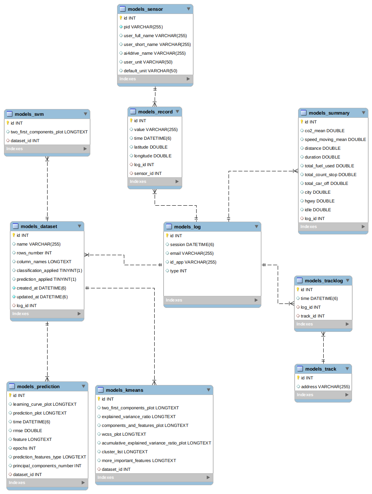

# Torque
## E/R diagram

## Install

``
cd Torque
`` \
``
python -m venv venv
`` \
``
source /venv/bin/activate
`` \
``
pip install -r requirements.txt
``

If you get an error installing cartopy. Probably you can fix the error with this

``
sudo apt-get install libproj-dev proj-data proj-bin  
``
``
sudo apt-get install libgeos-dev 
``

### Local
If you want to run using database in localhost, you have to uncomment the following section in settings.py:

You can choose to use postgreSQL or MySQL, so you have to uncomment one of these options:

```
DATABASES = {
    'default': {
        'ENGINE': 'django.db.backends.sqlite3',
        'NAME': 'torque_db',
    }
}
```
or MySQL
```
DATABASES = {
    'default': {
        'ENGINE': 'django.db.backends.mysql',
        'NAME': 'torque_db',
        'USER': 'user',
        'PASSWORD': 'password',
        'HOST': 'localhost',
        'PORT': '3306'
    }
}
```
You can uncomment and use mysql as the database, but **_database must be previously created_** 

#### load schema to database:

``
python manage.py migrate
``
####Data
In the Dump folder there is a backup of the database dated 12/22/2021 .
If you want to use this data you can import them using Mysql Workbench

MySQL Workbench >> Server >> Data Import

## Test
``
python manage.py runserver
``
